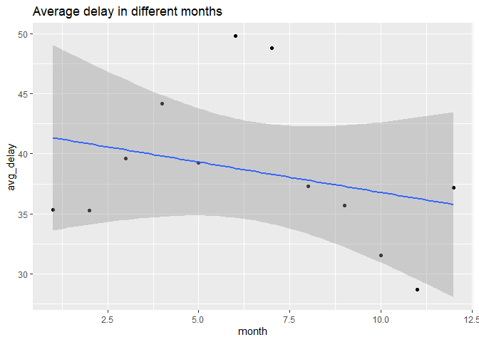
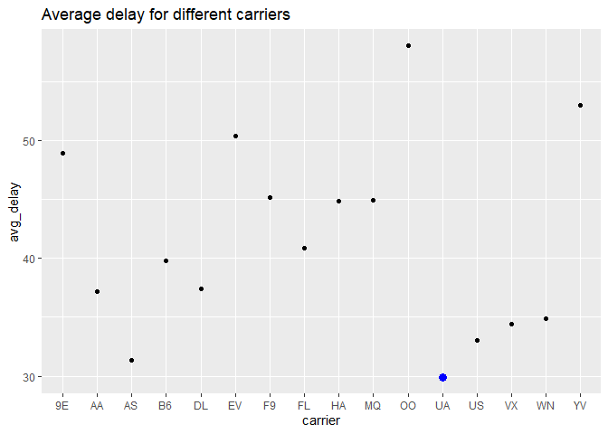
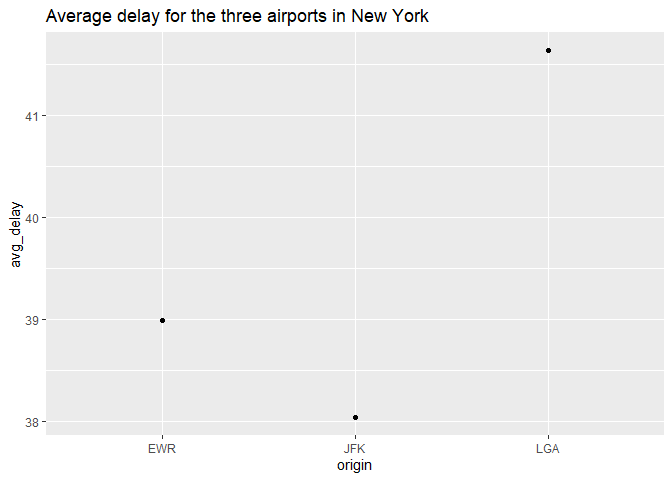

Stat 433 Hw 2
================
Gary Lin
2022-10-13

Here is my github url:[github](https://github.com/G-rexy/Stat433-HW2)

``` r
library(dplyr)
```

    ## 
    ## Attaching package: 'dplyr'

    ## The following objects are masked from 'package:stats':
    ## 
    ##     filter, lag

    ## The following objects are masked from 'package:base':
    ## 
    ##     intersect, setdiff, setequal, union

``` r
library(nycflights13)
library(ggplot2)
```

What time of day should you fly if you want to avoid delays as much as
possible? Does this choice depend on anything? Season? Weather? Airport?
Airline? Find three patterns (“null results” are ok!). Write your
results into Rmarkdown. Include a short introduction that summarizes the
three results. Then, have a section for each finding. Support each
finding with data summaries and visualizations. Include your code when
necessary.

``` r
flights %>% 
  filter (dep_delay > 0) %>% 
  group_by(hour) %>%
  summarize(avg_delay = mean(dep_delay)) %>%
  arrange(avg_delay)
```

    ## # A tibble: 19 × 2
    ##     hour avg_delay
    ##    <dbl>     <dbl>
    ##  1     5      15.3
    ##  2     7      24.1
    ##  3     6      24.2
    ##  4     9      29.7
    ##  5     8      29.9
    ##  6    12      32.3
    ##  7    11      32.5
    ##  8    10      32.6
    ##  9    13      33.5
    ## 10    14      37.1
    ## 11    23      38.0
    ## 12    15      38.8
    ## 13    16      43.4
    ## 14    17      45.3
    ## 15    18      46.5
    ## 16    22      46.5
    ## 17    20      49.6
    ## 18    21      50.3
    ## 19    19      51.1

According to the average delay time, the best time to fly is at the
morning at 5-ish.

The delay of the flights could be caused by the seasons, carriers, and
could be airports.

For the seasons:

``` r
m = flights %>% 
  filter (dep_delay > 0) %>% 
  group_by(month) %>%
  summarise(avg_delay = mean(dep_delay)) %>% 
  arrange(avg_delay)
  m
```

    ## # A tibble: 12 × 2
    ##    month avg_delay
    ##    <int>     <dbl>
    ##  1    11      28.7
    ##  2    10      31.6
    ##  3     2      35.3
    ##  4     1      35.3
    ##  5     9      35.7
    ##  6    12      37.2
    ##  7     8      37.3
    ##  8     5      39.2
    ##  9     3      39.6
    ## 10     4      44.2
    ## 11     7      48.8
    ## 12     6      49.8

``` r
  m %>% 
  ggplot(aes(x = month, y = avg_delay)) + 
    geom_point() + 
    geom_smooth(method = 'lm') +
    labs(title="Average delay in different months")
```

    ## `geom_smooth()` using formula 'y ~ x'

<!-- -->

From the plot we can see that around the middle of the year, which is
about late spring early summer, we have the highest average delay, and
around fall time the average delay is the lowest.

For carriers:

``` r
carriers = flights %>% 
  filter (dep_delay > 0) %>% 
  group_by(carrier) %>%
  summarize(avg_delay = mean(dep_delay)) %>%
  arrange(avg_delay)
  carriers
```

    ## # A tibble: 16 × 2
    ##    carrier avg_delay
    ##    <chr>       <dbl>
    ##  1 UA           29.9
    ##  2 AS           31.3
    ##  3 US           33.1
    ##  4 VX           34.5
    ##  5 WN           34.9
    ##  6 AA           37.2
    ##  7 DL           37.4
    ##  8 B6           39.8
    ##  9 FL           40.8
    ## 10 HA           44.8
    ## 11 MQ           44.9
    ## 12 F9           45.1
    ## 13 9E           48.9
    ## 14 EV           50.3
    ## 15 YV           53.0
    ## 16 OO           58

``` r
  carriers %>% ggplot(aes(x = carrier, y = avg_delay)) +
  geom_point() + 
  geom_point(data = carriers[which.min(carriers$avg_delay), ], color="blue", size=3) +
  labs(title="Average delay for different carriers")
```

<!-- -->

According to the plot, we can see that the UA has the lowest average
delay among the total 16 carriers, so that if wants to avoid delays, UA
may be a great choice.

For airports:

``` r
airport = flights %>% 
  filter (dep_delay > 0) %>% 
  group_by(origin) %>%
  summarize(avg_delay = mean(dep_delay, na.rm = TRUE)) %>%
  arrange(avg_delay) 
  airport
```

    ## # A tibble: 3 × 2
    ##   origin avg_delay
    ##   <chr>      <dbl>
    ## 1 JFK         38.0
    ## 2 EWR         39.0
    ## 3 LGA         41.6

``` r
  airport %>%  ggplot(aes(x = origin, y = avg_delay)) +
  geom_point() + labs(title="Average delay for the three airports in New York")
```

<!-- -->

From the plot we can see that among the three airports in New York, the
flights departure from JFK has lowest delay, so that JFK may be a good
choice to take the flight at.
